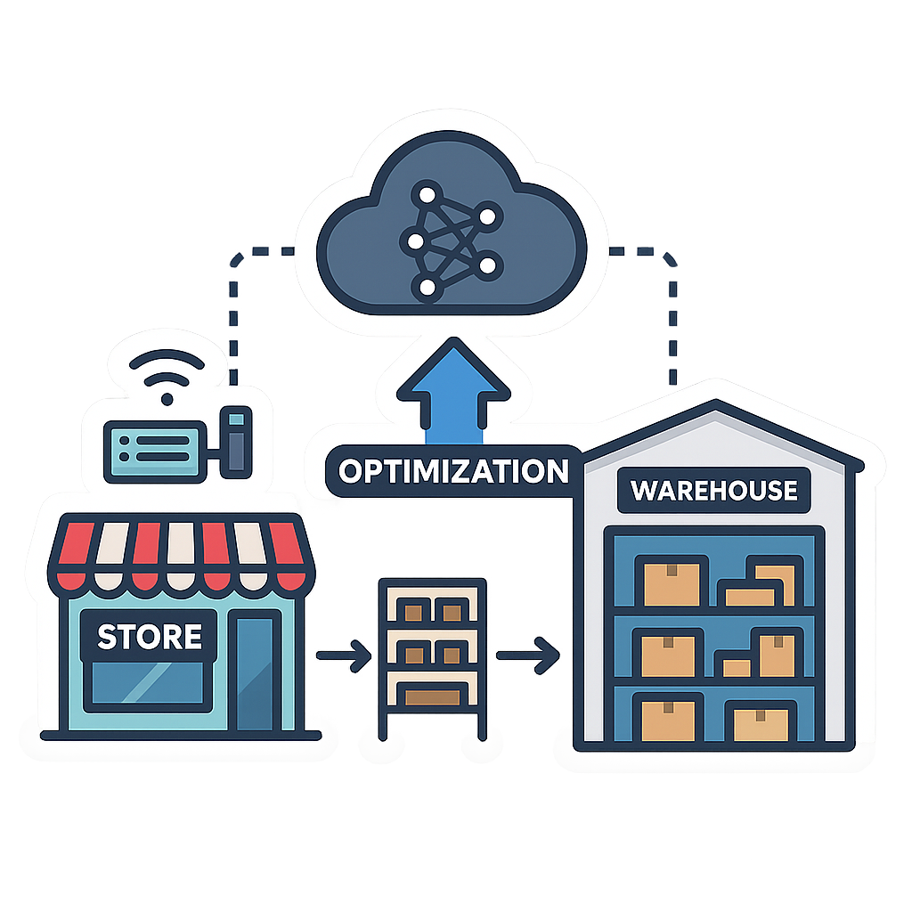
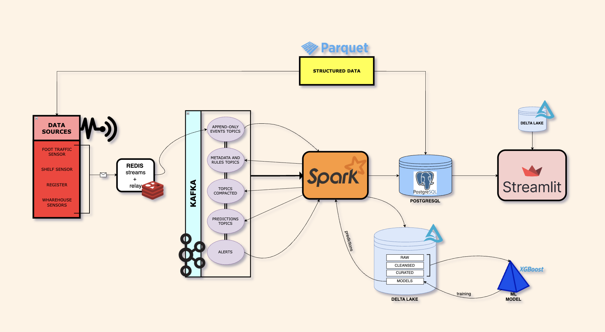
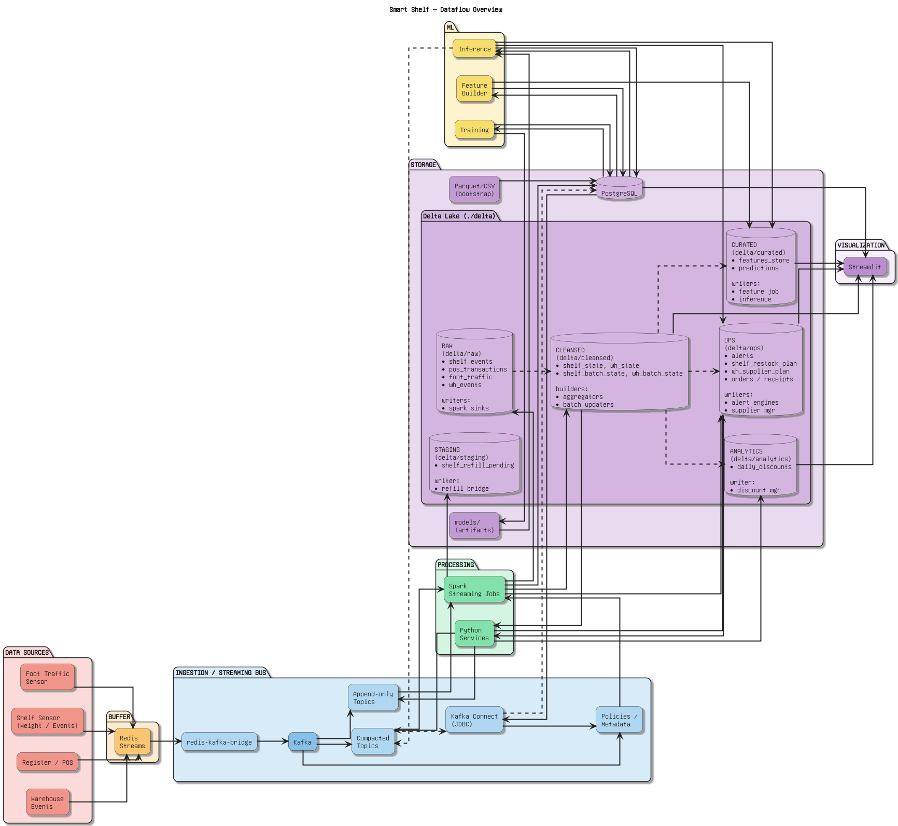
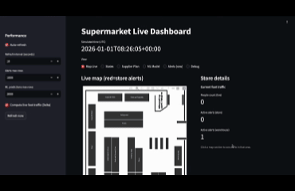
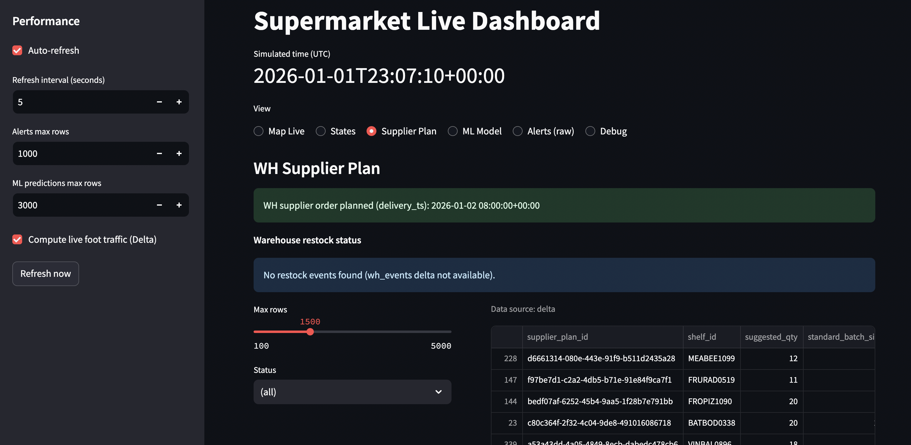
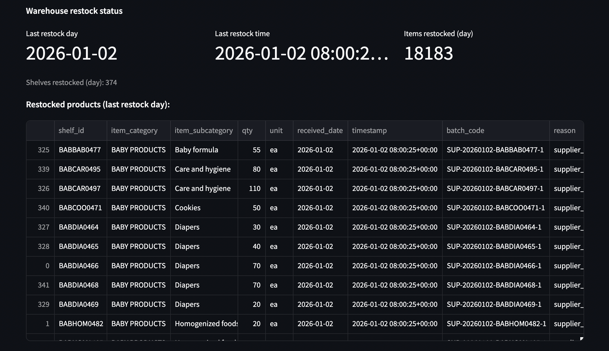
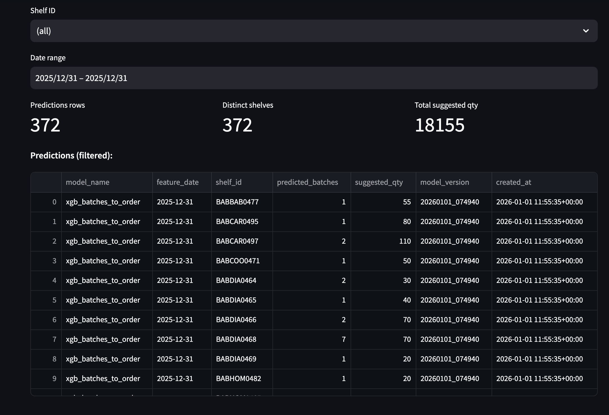
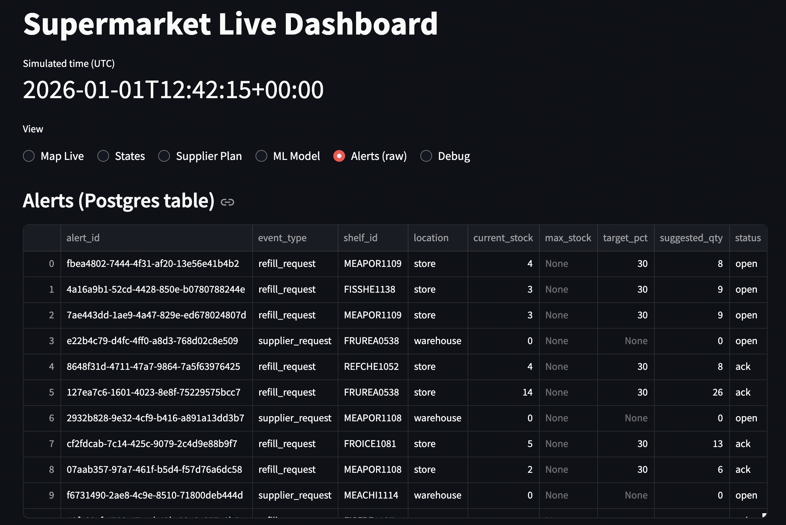

# Smart Shelf — Big Data Project



End-to-end (simulated) system to **monitor stock and batches** for a supermarket, generate **real-time events** (foot traffic, shelf interactions, POS transactions), and apply **alerting and replenishment logic** via **Kafka + Spark Structured Streaming**, with persistence on **Delta Lake** and **PostgreSQL**.

> This repository is meant to be run primarily via `docker compose`.

**Authors of the project**:
- Camilla Bonomo
- Chiara Belli
- Enrico Maria Guarnuto 

---


## Table of Contents

- [Smart Shelf — Big Data Project](#smart-shelf--big-data-project)
  - [Table of Contents](#table-of-contents)
  - [Repository Structure](#repository-structure)
  - [How to Run (Quickstart)](#how-to-run-quickstart)
    - [Prerequisites](#prerequisites)
    - [Minimal steps to start the full stack](#minimal-steps-to-start-the-full-stack)
  - [Project Overview](#project-overview)
    - [How it works (high level)](#how-it-works-high-level)
    - [Aim and ambition](#aim-and-ambition)
  - [Architecture](#architecture)
    - [Data Pipeline](#data-pipeline)
    - [Data Flow](#data-flow)
  - [Tech Stack](#tech-stack)
    - [Technologies and Justification](#technologies-and-justification)
      - [Core Technologies](#core-technologies)
      - [Real-Time Streaming \& Ingestion](#real-time-streaming--ingestion)
      - [Stream Processing \& Lakehouse Storage](#stream-processing--lakehouse-storage)
      - [Databases \& Data Access](#databases--data-access)
      - [Visualization](#visualization)
      - [Machine Learning](#machine-learning)
      - [Supporting Libraries](#supporting-libraries)
  - [Data \& Topics](#data--topics)
    - [Dataset (bootstrap)](#dataset-bootstrap)
    - [Data exploration](#data-exploration)
    - [Kafka topics](#kafka-topics)
    - [Delta Lake layout (main paths)](#delta-lake-layout-main-paths)
  - [Simulated Time](#simulated-time)
  - [Kafka (Producers \& Consumers)](#kafka-producers--consumers)
    - [Producers (simulation + scheduling)](#producers-simulation--scheduling)
    - [Consumers and “manager” services](#consumers-and-manager-services)
  - [Spark Apps](#spark-apps)
    - [Spark jobs (by role)](#spark-jobs-by-role)
  - [Kafka Connect](#kafka-connect)
  - [PostgreSQL Schemas](#postgresql-schemas)
  - [Streamlit Dashboard](#streamlit-dashboard)
    - [Data sources](#data-sources)
    - [Run](#run)
    - [Results (dashboard)](#results-dashboard)
      - [Store Live + Alerts](#store-live--alerts)
      - [Supplier Plan (Plan Created)](#supplier-plan-plan-created)
      - [Supplier Plan (Restock Delivered)](#supplier-plan-restock-delivered)
      - [ML Model (Training Ready)](#ml-model-training-ready)
      - [ML Model (Predicted Quantity)](#ml-model-predicted-quantity)
      - [Alerts Table (Raw Live)](#alerts-table-raw-live)
  - [ML / Demand Forecasting](#ml--demand-forecasting)
    - [Feature set](#feature-set)
    - [Main outputs](#main-outputs)
    - [Run](#run-1)
  - [Performance](#performance)
    - [Resource footprint](#resource-footprint)
    - [Tuning knobs (simulation and Spark)](#tuning-knobs-simulation-and-spark)
    - [Disk usage (Delta + checkpoints)](#disk-usage-delta--checkpoints)
  - [Lessons learned](#lessons-learned)
    - [Main challenges](#main-challenges)
    - [What worked well](#what-worked-well)
    - [What did not work](#what-did-not-work)
  - [Limitations and future work](#limitations-and-future-work)
    - [Limitations](#limitations)
    - [What would break first (and why)](#what-would-break-first-and-why)
    - [Future work](#future-work)
  - [References and acknowledgments](#references-and-acknowledgments)
    - [References](#references)
    - [Acknowledgments](#acknowledgments)

---


## Repository Structure

```text
.
├── docker-compose.yml                 # Full stack (Kafka/Redis/Postgres/Kafka Connect/Spark apps/ML dashboard)
├── conf/                              # Spark config (spark-defaults.conf)
├── data/                              # Synthetic datasets + generators + CSVs for Postgres bootstrap 
│   ├── create_db.py
│   ├── create_simulation_data.py
│   ├── create_discounts.py
│   ├── store_inventory_final.parquet
│   ├── warehouse_inventory_final.parquet
│   ├── store_batches.parquet
│   ├── warehouse_batches.parquet
│   ├── all_discounts.parquet
│   ├── sim_out/                       # Generated simulation outputs                 
├── delta/                             # Local Delta Lake (raw/cleansed/curated/ops/analytics + staging + _checkpoints)
├── dashboard/                         # Streamlit dashboard (map, alerts, state, ML)
│   ├── app.py
│   ├── store_layout.yaml
│   └── assets/
├── images/                            # Logo + diagrams + dashboard screenshots
├── kafka-components/                  # Kafka components (topics, connect, producers)
│   ├── kafka-init/                    
│   ├── kafka-connect/                 
│   ├── kafka-producer-foot_traffic/   
│   ├── kafka-producer-shelf/          
│   ├── kafka-producer-pos/            
│   ├── redis-kafka-bridge/            
│   ├── shelf-daily-features/          
│   ├── daily-discount-manager/        
│   ├── removal-scheduler/             
│   └── wh-supplier-manager/           
├── ml-model/                          # ML services (training + inference)
│   ├── training-service/             
│   └── inference-service/             
├── models/                            # Model artifacts + feature columns (mounted to /models)
├── postgresql/                        # DDL + init SQL (ref/config/state/ops/analytics + views)
│   ├── 01_make_db.sql
│   ├── 02_load_ref_from_csv.sql
│   ├── 03_load_config.sql
│   ├── 04_load_features_panel.sql
│   └── 05_views.sql
├── simulated_time/                    # Shared simulated clock (Redis)
├── spark-apps/                        # Spark Structured Streaming jobs
│   ├── deltalake/                     
│   ├── foot-traffic-raw-sink/         
│   ├── shelf-aggregator/              
│   ├── batch-state-updater/           
│   ├── shelf-alert-engine/            
│   ├── shelf-restock-manager/         
│   ├── shelf-refill-bridge/           
│   ├── wh-aggregator/                 
│   ├── wh-batch-state-updater/        
│   ├── wh-alert-engine/               
│   └── alerts-sink/                   
```

---


## How to Run (Quickstart)

### Prerequisites

- Docker + Docker Compose
- Internet connection during build (some images download dependencies/JARs)
- Python 3.x (Required for pre-launch data generation)
- Minimum resources (full stack, all services):
  - **CPU**: 8 vCPU
  - **RAM**: 16 GB
  Below that (e.g., 4 vCPU / 8 GB) the stack may still boot, but Spark jobs will contend heavily with Kafka/Postgres and you should expect frequent backpressure, long startup times, or OOMs during backfill.

### Minimal steps to start the full stack

```bash
git clone <https://github.com/EnricoMGuarnuto/Big_Data_Project.git>
cd Big_Data_Project
```

Once the repository is cloned, it is required to run the two main files that create the simulation data:
```bash
python data/create_db.py
python data/create_discounts.py
python data/create_simulation_data.py
```

Start the Stack:
```bash
docker compose up -d --build
```

Alternative (limited CPU/RAM): start without the Kafka producers (simulators), then enable them once the stack is stable.

- 1. Run the stack **without** the Kafka producers (simulators):
```bash
docker compose up -d --build $(docker compose config --services | grep -v '^kafka-producer')
```

- 2. Wait ~5–8 minutes and then:

Enable the Kafka producers (simulators):
```bash
docker compose up -d --build $(docker compose config --services | grep '^kafka-producer')
```

Verify services are up:

```bash
docker compose ps
```

Main services exposed:

- Postgres: `localhost:5432`
- Kafka Connect: `localhost:8083`
- Dashboard (optional): `http://localhost:8501`

Stop the stack:

```bash
docker compose down
```

For prerequisites, optional services, and troubleshooting see [How to Run](#how-to-run).

---

## Project Overview

This project simulates a **Smart Shelf retail system** end to end: from raw store activity, to operational decisions, to a live dashboard and a forecasting model.

In plain terms, the goal is to answer:

- What is happening in the store *right now*?
- What needs attention soon (alerts)?
- What should we restock, and when?
- Can we forecast demand early enough to plan supplier deliveries?

### How it works (high level)

1. **Simulate store activity.**
   We generate realistic streams of events such as customer traffic, shelf interactions (pickup/putback/weight change), POS sales, and warehouse movements.
2. **Build the current state.**
   Streaming jobs continuously turn those raw events into the latest “truth” (current shelf levels, warehouse levels, and batch/expiry state).
3. **Trigger operational decisions.**
   On top of the state, the system produces alerts and replenishment plans (store restock and supplier plans).
4. **Forecast ahead of cutoff times.**
   An ML pipeline runs on daily features and predicts how many batches should be ordered before supplier cutoffs.
5. **Make everything visible.**
   A dashboard surfaces the live map, alerts, states, plans, and ML outputs so the system can be inspected during a run.

### Aim and ambition

- **Aim:** show a complete, working blueprint of a modern retail data pipeline that supports real-time monitoring and decision-making.
- **Ambition:** go beyond “just streaming” by combining simulation, stateful processing, operational planning, and ML-driven forecasting in one coherent system.

Note on workload and data realism: this project is computationally heavy because it simulates the full pipeline. In a production scenario, much of this data would come from real retailer APIs or existing datasets. Since those were not available, we generated synthetic event and inventory/batch data to drive and validate the system under realistic assumptions. The synthetic catalog and structures were modeled after real operational data provided by a Conad supermarket (Scandiano (RE), Italy), giving the simulation a representative mix of product categories and turnover patterns.

---

## Architecture

### Data Pipeline



### Data Flow



Current implemented ingestion path for simulated store events: `Data generators -> Redis Streams -> redis-kafka-bridge -> Kafka -> Spark`.

---

## Tech Stack

| Technology | Role/Purpose |
|---|---|
| Python | Main language (dataset generation, Kafka producers, services/apps) |
| Docker / Docker Compose | Containerization and orchestration of the whole stack |
| Apache Kafka | Message broker for real-time streaming across components |
| Kafka Connect (JDBC) | PostgreSQL ↔ Kafka synchronization (metadata sources + state/ops sinks) |
| Redis Streams | “Before Kafka” buffer for producers (resilience/backpressure) |
| Apache Spark 3.5 (Structured Streaming) | Streaming processing, aggregations, alerting, and flow orchestration |
| Delta Lake | Filesystem-based data lake (`./delta`) for raw/cleansed/ops/analytics layers + checkpoints |
| PostgreSQL 16 | Database for snapshots (`ref`), config/policy (`config`), state (`state`), ops (`ops`) and analytics |

### Technologies and Justification

#### Core Technologies

- **Python — Main programming language**
  Used everywhere: data generation, producers/consumers, Spark job logic, ML services, and the Streamlit dashboard. It keeps the project consistent and fast to iterate on.
- **Docker / Docker Compose — Containerization and orchestration**
  This project depends on many services (Kafka, Postgres, Spark, Redis, etc.). Compose makes the environment reproducible and lets you start/stop the full stack with one command.

#### Real-Time Streaming & Ingestion

- **Apache Kafka — Distributed event streaming platform**
  Kafka is the central “event bus.” Producers write events once, and multiple consumers can process them independently. We also use compacted topics to represent the latest state/metadata.
- **Apache ZooKeeper — Kafka coordination (single-broker setup)**
  The Kafka image used here still relies on ZooKeeper for broker coordination, so we run it as part of the stack.
- **Kafka Connect + JDBC Connector — Data integration layer**
  This is the “bridge” between Postgres and Kafka. It sources reference/config tables into Kafka and sinks compacted state back into Postgres without custom ingestion code.
- **Redis Streams + Redis-Kafka bridge — Buffer and backpressure layer**
  Simulated producers write only to Redis Streams. A dedicated `redis-kafka-bridge` service reads Redis via consumer groups and forwards to Kafka, acknowledging Redis messages only after Kafka publish success.
- **kafka-python — Kafka client for Python**
  Used by the simulated producers and some utility jobs to publish/consume Kafka messages from Python.
- **confluent-kafka — Kafka client for high-throughput services**
  Used by services like the supplier/discount managers where a faster native client is helpful.
- **redis-py — Redis client for Python**
  Used to read/write Redis Streams and simulated-time keys from Python components.

#### Stream Processing & Lakehouse Storage

- **Apache Spark (Structured Streaming) — Stateful stream processing**
  Spark is the main stream processor. It builds shelf/warehouse state, generates alerts, and computes restock/supplier plans using stateful streaming + checkpoints.
- **Delta Lake (`delta-spark` + `deltalake`) — ACID tables on files**
  Delta Lake gives us reliable tables on top of local files (`./delta`). We use it for raw/cleansed/ops/analytics layers plus streaming sinks and checkpoints.
- **Apache Arrow / Parquet (`pyarrow`) — Columnar storage and I/O**
  Parquet is the main file format for bootstrap data, and `pyarrow` keeps Parquet/Arrow I/O fast and compatible across Spark, Delta, and Python.

#### Databases & Data Access

- **PostgreSQL 16 — Relational database**
  Postgres is the serving database. It stores reference snapshots, configuration/policies, state mirrors, ops tables, and analytics that are easy to query.
- **psycopg2 + SQLAlchemy — Postgres connectivity**
  These are the main Python DB tools: `psycopg2` for direct access and SQLAlchemy for safer, cleaner query/connection handling.

#### Visualization

- **Streamlit — Interactive dashboard**
  Streamlit lets us build a useful dashboard quickly, without a separate frontend stack.
- **Plotly — Interactive charts**
  Plotly provides interactive charts inside Streamlit for exploring trends and state.

#### Machine Learning

- **scikit-learn — Baseline ML + preprocessing**
  Used for preprocessing utilities and simple, dependable baseline ML pieces.
- **XGBoost — Gradient-boosted trees**
  The main forecasting model. It performs very well on tabular features like the ones in this project.
- **joblib — Model persistence**
  Used to save/load trained models reliably across training and inference.
- **pandas + NumPy — Data wrangling**
  Used throughout for feature engineering, dataset manipulation, and general “glue” code.

#### Supporting Libraries

- **PyYAML — Configuration parsing**
  Used to keep configuration readable instead of hardcoding parameters.
- **Pillow — Image handling**
  Used in the dashboard for lightweight image loading/manipulation.
- **streamlit-autorefresh / streamlit-plotly-events — Dashboard UX helpers**
  Small helpers that improve dashboard interactivity (auto-refresh, click/selection events).

---

## Data & Topics

### Dataset (bootstrap)

The main (generated) files are in `data/`:

- `data/store_inventory_final.parquet`
- `data/warehouse_inventory_final.parquet`
- `data/store_batches.parquet`
- `data/warehouse_batches.parquet`
- `data/all_discounts.parquet`
- `data/create_discounts.py`
- `data/create_simulation_data.py`

For DB bootstrap, CSVs are also created in `data/db_csv/` (used by scripts in `postgresql/`).

To regenerate everything:

```bash
python3 data/create_db.py
```

### Data exploration

Since, for privacy reasons, it was not possible to access real supermarket databases, we manually generated the inventory datasets, historical data of 1 year of sales, and the sensor simulators. Specifically:

- **Store inventory table**: 1,142 rows, max stock avg 48.13, current stock avg 38.85, visibility range 0.05–0.20 (`data/store_inventory_final.parquet`).
- **Warehouse inventory table**: 1,142 rows, warehouse capacity avg 306.23 units (`data/warehouse_inventory_final.parquet`).
- **Batch-level tables**: 1,830 store batches and 2,250 warehouse batches (includes expiry dates) (`data/store_batches.parquet`, `data/warehouse_batches.parquet`).
- **Weekly discounts table**: 9,360 rows with `discount_pct` range 0.0501–0.35 (`data/all_discounts.parquet`).
- **Total simulated sales**: 2,808,135 units across 2025 (`data/sim_out/synthetic_1y_panel.csv`).

Event sources simulated:

- **Shelf sensors**: pick-up, put-back, weight change events.
- **Foot traffic sensors**: customer entry, exit, and session duration.
- **POS transactions**: sales events linked to customers and products.
- **Warehouse events**: inbound and outbound stock movements.

Although synthetic, the data generation process preserves realistic temporal patterns and inter-dependencies between events. The simulation logic and datasets broadly follow the information provided to us through a conversation with the Conad of Scandiano regarding the operation and organization of the store.

### Kafka topics

Created by `kafka-components/kafka-init/init.py`.

- **Append‑only (event streams)**: `shelf_events`, `pos_transactions`, `foot_traffic`, `wh_events`, `alerts`
- **Compacted (state/metadata)**: `shelf_state`, `wh_state`, `shelf_batch_state`, `wh_batch_state`, `daily_discounts`, `shelf_restock_plan`, `wh_supplier_plan`, `shelf_policies`, `wh_policies`, `batch_catalog`, `shelf_profiles`

### Delta Lake layout (main paths)

- `delta/raw/`: `shelf_events`, `pos_transactions`, `foot_traffic`, `wh_events`
- `delta/cleansed/`: `shelf_state`, `wh_state`, `shelf_batch_state`, `wh_batch_state`
- `delta/curated/`: `product_total_state`, `features_store`, `predictions`
- `delta/ops/`: `alerts`, `shelf_restock_plan`, `wh_supplier_plan`, `wh_supplier_orders`, `wh_supplier_receipts`
- `delta/analytics/`: `daily_discounts`
- `delta/staging/`: `shelf_refill_pending`
- `delta/_checkpoints/`: Spark Structured Streaming checkpoints

---

## Simulated Time

The project includes a shared **simulated clock** that writes to Redis:

- keys: `sim:now` (timestamp) and `sim:today` (date).
- used by producers and Spark jobs to keep a consistent timeline during demos/tests.

Configuration (main env vars):

- `USE_SIMULATED_TIME` (default `0`, use `1` to enable the clock)
- `TIME_MULTIPLIER` (default `1.0`)
- `STEP_SECONDS` (default `1`)
- `SIM_DAYS` (default `365`, from `SIM_START` defined in `simulated_time/config.py`)


---

## Kafka (Producers & Consumers)

Kafka is the central event bus. Different components publish events, while others consume them to build state, trigger actions, or persist results.

### Producers (simulation + scheduling)

- `kafka-components/kafka-init/`: creates the topics used by the pipeline (append-only events and compacted state/metadata).
- `kafka-components/kafka-producer-foot_traffic/`: simulates customer entries/exits and buffers `foot_traffic` events on Redis Streams.
- `kafka-components/kafka-producer-shelf/`: simulates shelf sensor activity (pickup/putback/weight change) and buffers `shelf_events` on Redis Streams.
- `kafka-components/kafka-producer-pos/`: simulates carts/checkouts and buffers `pos_transactions` on Redis Streams (it also listens to shelf/foot traffic to keep the simulation coherent).
- `kafka-components/redis-kafka-bridge/`: forwards buffered Redis events to Kafka topics (`foot_traffic`, `foot_traffic_realistic`, `shelf_events`, `pos_transactions`).

### Consumers and “manager” services

- Spark jobs in `spark-apps/` are the main Kafka consumers. They turn raw events into state, alerts, and plans.
- `kafka-components/wh-supplier-manager/`: consumes supplier plans around cutoff times, issues supplier orders/receipts, and publishes the resulting `wh_events`.
- `kafka-components/daily-discount-manager/`: publishes daily discount updates (and mirrors them to Delta).
- `kafka-components/removal-scheduler/`: publishes removal events for expirations/cleanup scenarios.
- `kafka-components/shelf-daily-features/`: runs a daily batch that reads operational tables and writes `analytics.shelf_daily_features` for ML.

Kafka Connect is described separately below because it is an integration layer between Kafka and Postgres rather than a simulation or processing component.

---

## Spark Apps

Spark jobs live in `spark-apps/` and run as dedicated containers (base image `apache/spark:3.5.1-python3`).

In this project, Spark is the “state engine.” It continuously consumes Kafka events and maintains the latest operational state, then derives alerts and plans on top of that state.

### Spark jobs (by role)

Initialization:
- `spark-apps/deltalake/`: initializes empty Delta tables for raw/cleansed/ops/analytics layers.

Raw sinks:
- `spark-apps/foot-traffic-raw-sink/`: Kafka `foot_traffic` → Delta raw.

State builders:
- `spark-apps/shelf-aggregator/`: Kafka `shelf_events` (+ `shelf_profiles`) → Delta raw + Delta `shelf_state` + compacted `shelf_state`.
- `spark-apps/batch-state-updater/`: Kafka `pos_transactions` → Delta raw + Delta `shelf_batch_state` + compacted `shelf_batch_state`.
- `spark-apps/wh-aggregator/`: Kafka `wh_events` → Delta `wh_state` + compacted `wh_state`.
- `spark-apps/wh-batch-state-updater/`: Kafka `wh_events` → Delta `wh_batch_state` (+ mirror store batches) + compacted topics.

Alerting and planning:
- `spark-apps/shelf-alert-engine/`: `shelf_state` (+ policies + batch mirror) → `alerts` + `shelf_restock_plan` (Kafka + Delta).
- `spark-apps/wh-alert-engine/`: `wh_state` (+ policies + batch mirror) → `alerts` + `wh_supplier_plan` (Kafka + Delta).

Operational feedback loops:
- `spark-apps/shelf-restock-manager/`: `shelf_restock_plan` → `wh_events` (FIFO picking).
- `spark-apps/shelf-refill-bridge/`: `wh_events` (`wh_out`) → `shelf_events` (putback/weight_change) with a delay to simulate travel time.

Serving and persistence:
- `spark-apps/alerts-sink/`: `alerts` → Delta (+ optional Postgres).

Note: for Structured Streaming consumers you can set `MAX_OFFSETS_PER_TRIGGER` to avoid huge micro-batches on the first run with `STARTING_OFFSETS=earliest`.

---

## Kafka Connect

Connectors are registered by `connect-init` (`kafka-components/kafka-connect/connect-init/init.py`), and the container then exits.

- **Postgres → Kafka (source, compacted metadata)**: `batch_catalog`, `shelf_profiles`
- **Kafka → Postgres (sink)**:
  - upsert: `shelf_state`, `wh_state`, `shelf_batch_state`, `wh_batch_state`, `daily_discounts`, `shelf_restock_plan`, `wh_supplier_plan`
  - insert append‑only: `wh_events`

Note: to avoid duplicates, by default the `alerts` sink is not created (it is already handled by `alerts-sink` with `WRITE_TO_PG=1`), and the `pos_transactions` sink is not created (nested events not directly mappable to `ops.pos_transactions`/`ops.pos_transaction_items` with the JDBC sink).

---

## PostgreSQL Schemas

Initialization in `postgresql/01_make_db.sql` with schemas:

- `ref`: snapshots imported from CSVs (inventory and batches).
- `config`: policies and metadata (e.g. `shelf_policies`, `wh_policies`).
- `state`: state materializations (mirrors of compacted topics).
- `ops`: operational events, alerts, plans.
- `analytics`: analytics tables (e.g. `daily_discounts`).

CSVs are loaded by `postgresql/02_load_ref_from_csv.sql`, and default policies are populated by `postgresql/03_load_config.sql`.

Relevant analytics tables/views:

- `analytics.shelf_daily_features`: daily feature engineering (ML inputs).
- `analytics.v_ml_features`, `analytics.v_ml_train`: views for inference/training.
- `analytics.ml_models`, `analytics.ml_predictions_log`: model registry and prediction logs.

---

## Streamlit Dashboard

Streamlit dashboard in `dashboard/app.py` that shows:

- interactive store map with clickable zones and alert overlay.
- shelf/warehouse state tables from Delta with filters by category, subcategory, and shelf.
- supplier plan view with next delivery date (Delta first, Postgres fallback).
- ML model registry and prediction explorer from Postgres.
- raw alerts table plus debug/config panel.
- uses simulated time when available; otherwise falls back to UTC.

### Data sources

- Inventory + layout: `data/db_csv/store_inventory_final.csv`, `dashboard/store_layout.yaml`, `dashboard/assets/supermarket_map.png`
- Delta: `delta/cleansed/shelf_state`, `delta/cleansed/wh_state`, `delta/cleansed/shelf_batch_state`, `delta/cleansed/wh_batch_state`, `delta/ops/wh_supplier_plan`, `delta/ops/wh_supplier_orders`
- Postgres (read-only): `ops.alerts`, `ops.wh_supplier_plan` (fallback), `analytics.ml_models`, `analytics.ml_predictions_log`


### Run

```bash
docker compose up -d dashboard
```

port: `8501`

### Results (dashboard)

The dashboard consolidates real-time-ish operations (alerts, states, supplier plans) with ML outputs to show how the pipeline behaves end-to-end during a simulated run.

#### Store Live + Alerts

Short clip of the live store view where alerts appear and clear over time.
 


#### Supplier Plan (Plan Created)

This shows the moment a supplier plan is generated and marked as planned/pending around the cutoff.



#### Supplier Plan (Restock Delivered)

This shows the plan after delivery/restock has been executed and the state is updated.



#### ML Model (Training Ready)

Model registry view showing that training completed and a model is available for inference.


#### ML Model (Predicted Quantity)

Prediction explorer showing the suggested order quantity produced by the model.



#### Alerts Table (Raw Live)

Raw alerts table with the latest alerts as they stream through the pipeline.



---

## ML / Demand Forecasting

The ML pipeline consists of:

1. **Daily feature engineering** – service `kafka-components/shelf-daily-features` that populates `analytics.shelf_daily_features` and appends the same daily snapshot to `delta/curated/features_store`.
2. **ML views** – `analytics.v_ml_features` and `analytics.v_ml_train` (defined in `postgresql/05_views.sql`).
3. **Training** – `ml-model/training-service` service (XGBoost + time-series CV), writes model artifacts to `models/` and registers metadata in `analytics.ml_models`.
4. **Inference** – `ml-model/inference-service` service that loads the latest model, generates pending supplier plans around cutoff times (Sun/Tue/Thu 12:00 UTC), logs predictions in `analytics.ml_predictions_log`, and appends them to `delta/curated/predictions` (with optional Kafka publish for plans).

### Feature set

- master data: category/subcategory.
- calendar: `day_of_week`, `is_weekend`, `refill_day`.
- pricing/discount: price, discount, current/future discount flags.
- demand: `people_count`, sales in the last 1/7/14 days.
- shelf stock: capacity, fill ratio, threshold, expired, recent alerts.
- warehouse stock: capacity, fill ratio, reorder point, pending supplier, expired, recent alerts.
- expirations and batches: `standard_batch_size`, `min/avg_expiration_days`, `qty_expiring_next_7d`.
- training target: `batches_to_order` (training only).

### Main outputs

- `analytics.shelf_daily_features`
- `analytics.ml_models`
- `analytics.ml_predictions_log`
- `delta/curated/features_store`
- `delta/curated/predictions`
- `ops.wh_supplier_plan` (+ `delta/ops/wh_supplier_plan`)
- `models/<MODEL_NAME>_<YYYYMMDD_HHMMSS>.json`
- `models/<MODEL_NAME>_feature_columns.json`

The `models/` directory is mounted to `/models` in Docker Compose for both training and inference.


### Run

```bash
docker compose up -d sim-clock shelf-daily-features training-service inference-service
```

Note:
- `training-service` runs once and then exits (may skip if `RETRAIN_DAYS` is set and the model is still fresh).
- `inference-service` stays idle and triggers only around the configured cutoff schedule (see `CUTOFF_*` env vars).

---

## Performance

### Resource footprint

This project runs multiple stateful services (Kafka, Postgres, Redis, Spark streaming jobs, optional Kafka Connect, ML services, and a Streamlit UI). Running the full stack is CPU- and RAM-intensive, and the first run can be particularly heavy when Spark jobs start from `STARTING_OFFSETS=earliest` (they may backfill large portions of the topics).


### Tuning knobs (simulation and Spark)

- Producers:
  - `kafka-producer-foot-traffic`, `kafka-producer-pos`: tune `SLEEP` and `TIME_SCALE`.
  - `kafka-producer-shelf`: tune `SHELF_SLEEP`.
- Simulated clock: tune `TIME_MULTIPLIER` and `STEP_SECONDS` (see `.env` and `simulated_time/README.md`).
- Spark consumers:
  - Prefer `STARTING_OFFSETS=latest` for iterative development; use `earliest` only when you intentionally want a full replay.
  - Reduce `MAX_OFFSETS_PER_TRIGGER` if you see memory pressure or very large micro-batches on startup.

### Disk usage (Delta + checkpoints)

The `delta/` directory (tables + `_checkpoints/`) can grow quickly during streaming runs. Checkpoint paths encode the streaming progress; removing checkpoints forces a replay from Kafka offsets and should be done only when you explicitly want to reset consumer state.

---

## Lessons learned

### Main challenges

One of the main challenges was designing Kafka topics that guarantee full traceability through append-only logs while still enabling fast access to state via compaction. Ensuring correctness in stateful streaming also required careful attention, particularly in the management of stable keys and rigorous checkpointing. However, due to the very nature of the simulation-based architecture, it is not feasible to avoid resetting checkpoints every time the project is started. Doing so would also require checkpointing the simulated time, an option that was not implemented. In addition, reliably orchestrating a large number of containers proved to be complex, especially when handling service dependencies such as database initialization, connector startup, and the execution of Spark jobs.

### What worked well

Using a simulated time source made demos and tests far more predictable, allowing expiry rules, reorder cycles, and cutoffs to be reproduced reliably. The clear separation between raw and derived data sped up debugging and made analytical queries easier to write and reason about.

### What did not work

Stateful processing was particularly sensitive to key drift and inconsistent checkpoints, where even small mistakes could cascade into incorrect state. Due to the need to generate simulated data, the program cannot be supported on machines with very limited CPU and RAM. Container startup was fragile without explicit dependency sequencing and better operational runbooks.

## Limitations and future work

### Limitations

- Data is synthetic/simulated; real deployments need integration with real sensor systems and stronger data quality guarantees.
- Single-node Docker setup (single Kafka broker, local Delta filesystem) does not represent production scaling.
- Stateful Spark jobs may become bottlenecked by state size, shuffle-heavy joins, and checkpoint I/O as event rate count increases.
- Checkpoints need to be deleted after every new run.
- CPU and RAM usage are very high.

### What would break first (and why)

- Kafka throughput/partitions (insufficient parallelism), Spark micro-batch latency, and Delta checkpoint growth/storage bandwidth.
- PostgreSQL write amplification if too many derived tables are sunk at high frequency.
- Containers go down not for errors but for OOM issues that need to be handled.

### Future work

- Move Delta tables to object storage to separate compute from storage and handle growth reliably.
- Use a schema registry and compatibility rules so producers can change event formats without silently breaking downstream consumers.
- Always compare XGBoost against a simple baseline (like a moving average) to prove the model actually adds value.
- Efficient recovery of the program from checkpoints if it is shut down during processing.
- Optimise the usage of CPU and RAM.

---

## References and acknowledgments

### References

- Drive Research. Grocery store statistics: Where, when, and how much people grocery shop. https://www.driveresearch.com/market-research-company-blog/grocery-store-statistics-where-when-how-much-people-grocery-shop/
- Huang, A., Zhang, Z., Yang, L., & Ou, J. (2024). Design of Intelligent Warehouse Management System. 2024 4th International Conference on Electronic Information Engineering and Computer (EIECT), 534–538. https://doi.org/10.1109/EIECT64462.2024.10866043

### Acknowledgments

- Conad supermarket (Scandiano (RE), Italy) for providing real-world category/inventory structure used to model the synthetic data.
- External contributors/maintainers of the open-source libraries used in the stack.
