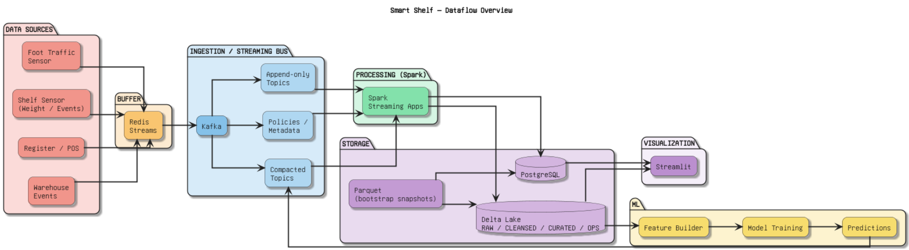

# Smart Shelf — Big Data Project


Sistema end‑to‑end (simulato) per **monitorare stock e lotti** di un supermercato, generare **eventi in tempo reale** (foot traffic, interazioni con gli scaffali, transazioni POS) e applicare **logiche di alerting e replenishment** tramite **Kafka + Spark Structured Streaming**, con persistenza su **Delta Lake** e **PostgreSQL**.

> Questo repository è pensato per essere eseguito principalmente via `docker compose`.

---

## Table of Contents

- [Project Overview](#project-overview)
- [Architecture](#architecture)
  - [Data Pipeline](#data-pipeline)
  - [Data Flow](#data-flow)
- [Tech Stack](#tech-stack)
- [Repository Structure](#repository-structure)
- [Data & Topics](#data--topics)
- [How to Run](#how-to-run)
- [Spark Apps](#spark-apps)
- [Kafka Connect](#kafka-connect)
- [PostgreSQL Schemas](#postgresql-schemas)
- [Streamlit Dashboard](#streamlit-dashboard)
- [ML / Demand Forecasting](#ml--demand-forecasting)
- [Performance](#performance)
- [Troubleshooting](#troubleshooting)

---

## Project Overview

L’idea è simulare un sistema “Smart Shelf” dove:

- **Sensori / eventi** (simulati) producono stream di dati: ingressi/uscite clienti, pickup/putback/weight change sugli scaffali, transazioni POS, movimenti warehouse.
- **Kafka** è lo streaming bus, con topic **append‑only** (eventi) e **compacted** (stati/metadati).
- **Spark Structured Streaming** costruisce e mantiene gli **stati** (es. `shelf_state`, `wh_state`, batch states), genera **alert** e **piani di restock**.
- **Delta Lake (filesystem)** è il data lake (raw/cleansed/ops/analytics).
- **PostgreSQL** mantiene snapshot di riferimento, config/policy e materializzazioni utili per query/serving.
- **Kafka Connect (JDBC)** sincronizza Postgres ↔ Kafka per metadata e state tables.

---

## Architecture

### Data Pipeline


### Data Flow



> Nota: i file `data_pipeline.png` e `data_flow.png` sono referenziati direttamente dal README; sostituiscili con le immagini finali mantenendo gli stessi nomi.

---

## Tech Stack

| Technology | Role/Purpose |
|---|---|
| Python | Linguaggio principale (dataset generator, producer Kafka, servizi/applicazioni) |
| Docker / Docker Compose | Containerization e orchestrazione dell’intera stack |
| Apache Kafka | Message broker per streaming real‑time tra componenti |
| Kafka Connect (JDBC) | Sincronizzazione PostgreSQL ↔ Kafka (source metadata + sink state/ops) |
| Redis Streams | Buffer “before Kafka” per i producer (resilienza/backpressure) |
| Apache Spark 3.5 (Structured Streaming) | Processing streaming, aggregazioni, alerting e orchestration dei flussi |
| Delta Lake | Data lake su filesystem (`./delta`) per layer raw/cleansed/ops/analytics e checkpoint |
| PostgreSQL 16 | Database per snapshot (`ref`), config/policy (`config`), state (`state`), ops (`ops`) e analytics |

---

## Repository Structure

```text
.
├── docker-compose.yml                 # Stack completa (Kafka/Redis/Postgres/Kafka Connect/Spark apps/producer)
├── conf/                              # Spark config (spark-defaults.conf)
├── data/                              # Dataset sintetici + generator + CSV per bootstrap Postgres
│   ├── create_db.py
│   └── db_csv/                        # CSV importati da Postgres in init
├── delta/                             # Delta Lake locale (raw/cleansed/ops/analytics + checkpoint)
├── kafka-components/                  # Componenti Kafka (topic, connect, producer)
│   ├── kafka-init/                    # Crea topic (append-only + compacted)
│   ├── kafka-connect/                 # Kafka Connect + init connector JDBC
│   ├── kafka-producer-foot_traffic/   # Producer foot traffic (session + realistico)
│   ├── kafka-producer-shelf/          # Producer shelf events (pickup/putback/weight_change)
│   └── kafka-producer-pos/            # Producer POS transactions (da foot traffic + shelf events)
├── postgresql/                        # DDL + init SQL (ref/config/state/ops/analytics)
│   ├── 01_make_db.sql
│   ├── 02_load_ref_from_csv.sql
│   └── 03_load_config.sql
├── spark-apps/                        # Spark Structured Streaming jobs
│   ├── deltalake/                     # Bootstrap tabelle Delta “vuote”
│   ├── foot-traffic-raw-sink/         # Kafka foot_traffic -> Delta raw
│   ├── shelf-aggregator/              # shelf_events -> raw + shelf_state (Delta + Kafka compacted)
│   ├── batch-state-updater/           # pos_transactions -> shelf_batch_state (Delta + Kafka compacted)
│   ├── shelf-alert-engine/            # shelf_state -> alerts + shelf_restock_plan
│   ├── shelf-restock-manager/         # shelf_restock_plan -> wh_events (FIFO picking)
│   ├── shelf-refill-bridge/           # wh_events (wh_out) -> shelf_events (delay)
│   ├── wh-aggregator/                 # wh_events -> wh_state
│   ├── wh-batch-state-updater/        # wh_events -> wh_batch_state (+ mirror store batches)
│   ├── wh-alert-engine/               # wh_state -> alerts + wh_supplier_plan
│   ├── wh-supplier-manager/           # Scheduler ordini/receipts supplier
│   ├── daily-discount-manager/        # near-expiry -> daily_discounts
│   └── alerts-sink/                   # alerts -> Delta (+ opzionale Postgres)
├── dashboard/                         # ...
└── demand-forecastor/                 # ...
```

---

## Data & Topics

### Dataset (bootstrap)

I file principali (generati) sono in `data/`:

- `data/store_inventory_final.parquet`
- `data/warehouse_inventory_final.parquet`
- `data/store_batches.parquet`
- `data/warehouse_batches.parquet`
- `data/all_discounts.parquet`

Per bootstrap del DB vengono creati anche i CSV in `data/db_csv/` (utilizzati dagli script in `postgresql/`).

Per rigenerare tutto:

```bash
python3 data/create_db.py
```

### Kafka topics

Creati da `kafka-components/kafka-init/init.py`.

- **Append‑only (event streams)**: `shelf_events`, `pos_transactions`, `foot_traffic`, `wh_events`, `alerts`
- **Compacted (state/metadata)**: `shelf_state`, `wh_state`, `shelf_batch_state`, `wh_batch_state`, `daily_discounts`, `shelf_restock_plan`, `wh_supplier_plan`, `shelf_policies`, `wh_policies`, `batch_catalog`, `shelf_profiles`

---

## How to Run

### Prerequisiti

- Docker + Docker Compose
- Connessione Internet durante la build (alcune immagini scaricano dipendenze/JAR)

### Avvio

```bash
docker compose up -d --build
```

Servizi principali esposti:

- Postgres: `localhost:5432`
- Kafka Connect: `localhost:8083`

Credenziali Postgres (default da `docker-compose.yml`):

- DB: `smart_shelf`
- User: `bdt_user`
- Password: `bdt_password`

Per verificare lo stato:

```bash
docker compose ps
docker compose logs -f kafka-init connect-init spark-init-delta
```

### Stop

```bash
docker compose down
```

---

## Spark Apps

I job Spark sono in `spark-apps/` e girano come container dedicati (base `apache/spark:3.5.1-python3`).

Principali componenti (vedi i README dentro ogni cartella):

- `spark-apps/deltalake/`: inizializza le tabelle Delta “vuote” (raw/cleansed/ops/analytics).
- `spark-apps/foot-traffic-raw-sink/`: Kafka `foot_traffic` → Delta RAW.
- `spark-apps/shelf-aggregator/`: Kafka `shelf_events` (+ `shelf_profiles`) → Delta RAW + Delta `shelf_state` + topic compatto `shelf_state`.
- `spark-apps/batch-state-updater/`: `pos_transactions` → Delta `shelf_batch_state` + topic compatto.
- `spark-apps/wh-aggregator/`: `wh_events` → Delta `wh_state` + topic compatto.
- `spark-apps/wh-batch-state-updater/`: `wh_events` → Delta `wh_batch_state` (+ mirror store batches) + topic compatti.
- `spark-apps/shelf-alert-engine/`: `shelf_state` (+ policy + batch mirror) → `alerts` + `shelf_restock_plan` (Kafka + Delta).
- `spark-apps/wh-alert-engine/`: `wh_state` (+ policy + batch mirror) → `alerts` + `wh_supplier_plan` (Kafka + Delta).
- `spark-apps/shelf-restock-manager/`: `shelf_restock_plan` → `wh_events` (picking FIFO).
- `spark-apps/shelf-refill-bridge/`: `wh_events` (wh_out) → `shelf_events` (putback/weight_change) con delay.
- `spark-apps/alerts-sink/`: `alerts` → Delta (+ opzionale Postgres).
- `spark-apps/daily-discount-manager/`: trova lotti in scadenza e pubblica `daily_discounts`.

---

## Kafka Connect

I connector vengono registrati da `kafka-components/kafka-connect/connect-init/init.py`:

- **Postgres → Kafka (source, compacted metadata)**: `shelf_policies`, `wh_policies`, `batch_catalog`, `shelf_profiles`
- **Kafka → Postgres (sink)**:
  - upsert state: `shelf_state`, `wh_state`, `shelf_batch_state`, `wh_batch_state`, `daily_discounts`, `shelf_restock_plan`, `wh_supplier_plan`
  - insert append‑only: `wh_events`, `pos_transactions`, `alerts`

---

## PostgreSQL Schemas

Inizializzazione in `postgresql/01_make_db.sql` con schemi:

- `ref`: snapshot importati da CSV (inventory e batches).
- `config`: policy e metadata (es. `shelf_policies`, `wh_policies`).
- `state`: materializzazioni degli stati (mirror dei topic compacted).
- `ops`: eventi operativi, alert, piani.
- `analytics`: tabelle analitiche (es. `daily_discounts`).

I CSV vengono caricati da `postgresql/02_load_ref_from_csv.sql` e le policy di default vengono popolate da `postgresql/03_load_config.sql`.

---

## Streamlit Dashboard

...

---

## ML / Demand Forecasting

...

---

## Performance

...

---

## Troubleshooting

- Se `kafka-init` o `connect-init` falliscono, controllare i log con `docker compose logs -f kafka-init connect-init`.
- Se Spark non parte durante la build, verificare l’accesso a Internet (download JAR/`--packages`).
- Se Postgres non carica i CSV, verificare che `data/db_csv/*.csv` esistano e che il volume `./data/db_csv:/import/csv:ro` sia montato correttamente.
